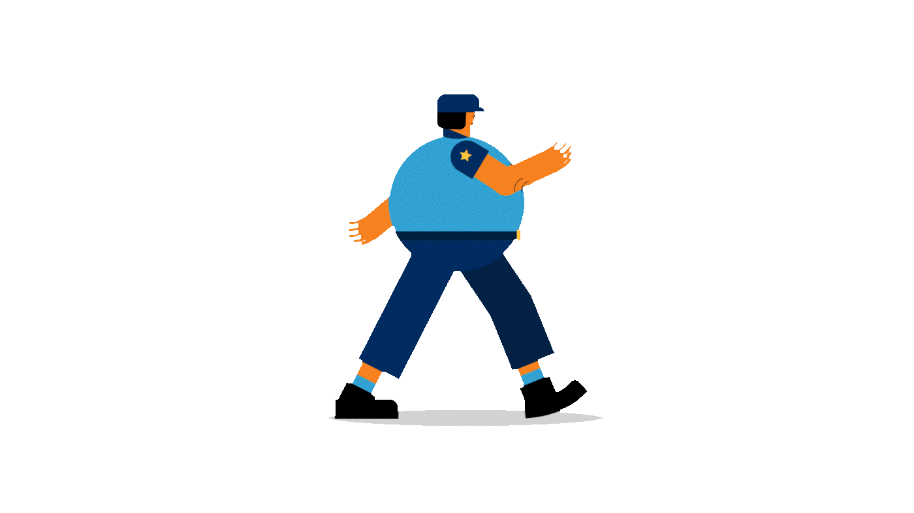

<!DOCTYPE html>
<html lang="es">
<head>
    <meta charset="UTF-8">
    <meta name="viewport" content="width=device-width, initial-scale=1.0">
    <title>Estamos trabajando para mejorar tu experiencia Ergosistem</title>
    
</head>
<body>
    <!-- Contenedor del logo -->
    

         <!-- Cambia la ruta del logo -->
    

    <!-- Contenedor del GIF -->
    

         <!-- Cambia la ruta del GIF -->
    

    <!-- Texto con efecto de cambio de color -->
    

        Estamos trabajando en algo increíble
    

    <!-- Texto y enlaces -->
    
Trabajamos en mejorar tu experiencia web con nuestras soluciones innovadoras. ¡Ya Volvemos!

    

        <a href="https://www.linkedin.com/company/ergosistem/" target="_blank">
             <!-- Cambia la ruta del logo de LinkedIn -->
            LinkedIn
        </a>
        <a href="https://facebook.com/ErgosistemPeru" target="_blank">
             <!-- Cambia la ruta del logo de Facebook -->
            Facebook
        </a>       
    

</body>
</html>
